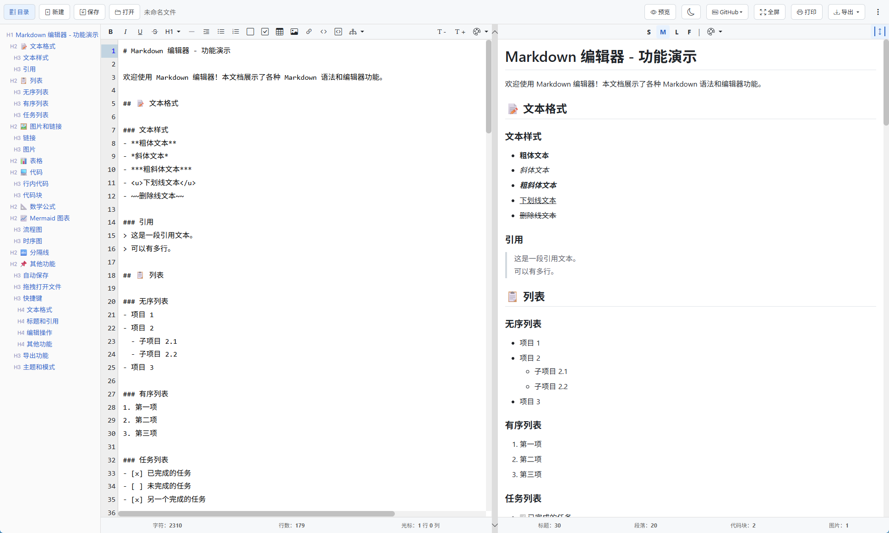

# Web Markdown Editor
**单文件** Web Markdown 编辑器，支持实时预览、语法高亮、数学公式和图表渲染。  
只需一个 HTML 文件即可运行，无需安装、无需依赖、无需服务器，双击即用，方便复制分享！

**[点击打开查看效果](https://wangwen135.github.io/web-markdown-editor/markdown-editor.html)**

## ✨ 功能特性
- ✅ 实时 Markdown 预览
- ✅ 代码语法高亮（支持多种编程语言）
- ✅ 数学公式渲染（KaTeX）
- ✅ 图表绘制（Mermaid）
- ✅ 导出为 PDF、图片（PNG）、HTML
- ✅ 多主题支持（亮色/暗色模式）
- ✅ 目录导航和同步滚动
- ✅ 本地文件保存和打开（支持 File System Access API）
- ✅ 拖拽文件到编辑器的方式打开查看
- ✅ 完全离线版本支持

## 📸 系统界面

 


## 🚀 快速开始

### 在线版本

直接用浏览器打开 `markdown-editor.html` 即可使用。

**[📥 下载 web-markdown-editor.html](/raw/refs/heads/main/markdown-editor.html)**

### 离线版本

适用于内网环境或无网络连接的场景。

**使用预打包版本**：

1. **[📥 下载 web-markdown-editor-offline.zip](/releases/download/v1.0.0/web-markdown-editor-offline.zip)**
2. 解压到任意目录
3. 用浏览器打开 `markdown-editor-offline.html`
4. 开始使用，无需任何网络连接！

## 📦 版本说明

| 版本 | 文件 | 说明 |
|------|------|------|
| **在线版** | `markdown-editor.html` | 使用 CDN 资源，需要网络连接 |
| **离线版** | `offline/markdown-editor-offline.html` | 所有资源本地化，完全离线运行 |

## 🔨 构建离线版本

只需维护在线版本，离线版本通过构建脚本自动生成。

### 构建步骤

```bash
# 运行构建脚本
node build-offline.js
```

构建脚本会自动：
1. 读取 `markdown-editor.html`
2. 将所有 CDN 链接替换为本地 `assets/` 路径
3. 输出到 `offline/markdown-editor-offline.html`


### 新增依赖

如果新增了 CDN 依赖，只需在 `build-offline.js` 中添加映射：

1. **HTML head 中的 `<link>` 或 `<script>`** → 添加到 `replacementRules` 数组
2. **JavaScript 中的 URL** → 添加到 `themeUrlMappings` 对象（会自动全局替换）


## 🛠️ 技术栈

- **前端**: 原生 HTML/CSS/JavaScript
- **Markdown 解析**: Marked.js
- **代码高亮**: Highlight.js
- **数学公式**: KaTeX
- **图表**: Mermaid.js
- **UI 框架**: Bootstrap 5
- **导出功能**: html2pdf.js, html2canvas

## 📄 许可证

MIT License


